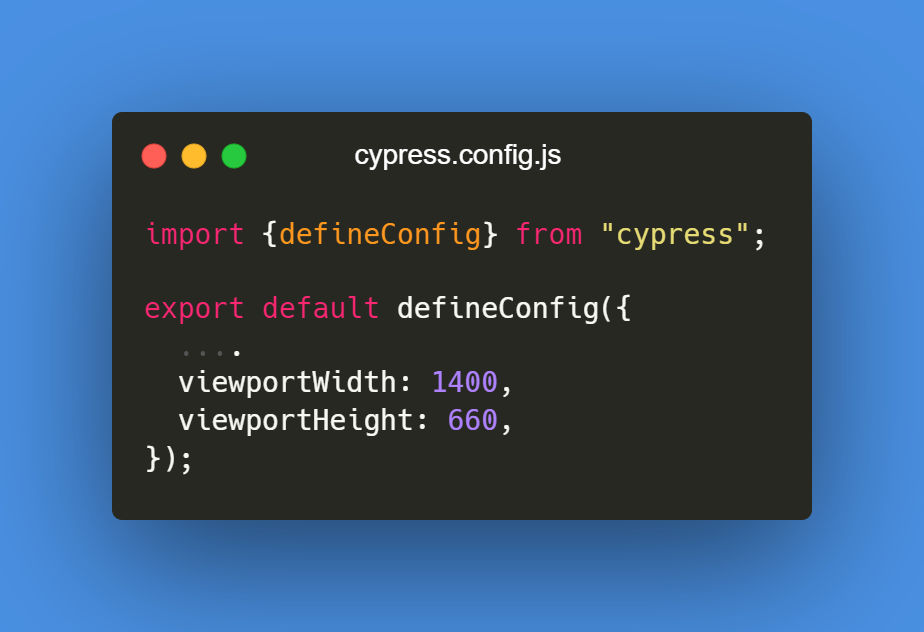

# Multi Step Form

### Tech Stack used:

- Vite React
- Typescript
- Pnpm
- Cypress
- Tailwind

### Guide to run cypress
#### Clone project
``` bash
git clone https://github.com/Shwetzksk/multi-step-form-cypress-testing.git
```
#### Install packages
``` bash
pnpm i
```

#### Run app locally
``` bash
pnpm run dev
```

#### Run cypress
``` bash
npx cypress open
```

### What I learnt?

My goal of creating this project was to practice Cypress that I learnt from [Freecodecamp](https://www.youtube.com/watch?v=u8vMu7viCm8&t=134s).

While working on this project I learnt about project setting up:

- Eslint
- Prettier config
- Dynamic import for Vite React project.

### Cypress testing:


Wrote test cases for Sidebar and Step-1 form.
Added custom command.

### UI Screen

The screens I have taken from [Multi-step form by Frontend Mentor](https://www.frontendmentor.io/challenges/multistep-form-YVAnSdqQBJ)

### Challenge I faced:

1. As I rendered my component in Cypress screen, the width was less.
   How to adjust width & height of screen which is rendering your component?
   

2. When working with Tailwind, it's crucial to import the styles in the JavaScript file where components are rendered for Cypress testing. For more details, visit [link](https://docs.cypress.io/guides/component-testing/styling-componentst.)
